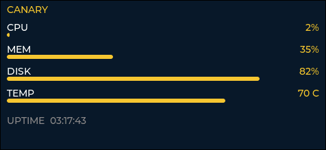

# canary-ui

A small LVGL dashboard showing live system stats (CPU, memory, disk, temperature, uptime), built to run on the LCD of an STM32MP135F-DK board as part of the [CANARY](https://github.com/bilal-marghich/canary) project.



Runs on desktop Linux (SDL backend) for development, and is meant to be cross-compiled into a Yocto image via a `.bb` recipe fetching this repo.

## Building on desktop (SDL)

```bash
sudo apt install libsdl2-dev cmake build-essential
git clone --recursive https://github.com/bilal-marghich/canary-ui.git
cd canary-ui
mkdir build && cd build
cmake ..
make -js
./canary-ui
```

## Stats source

All system reads live in `system_stats.c` / `system_stats.h`, independent of LVGL:

- CPU usage — parsed from `/proc/stat`, two samples one second apart
- Memory usage — `sysinfo()`
- Disk usage — `statvfs()` on `/`
- Temperature — `/sys/class/thermal/thermal_zone0/temp`, the standard Linux kernel thermal interface, works on both the STM32MP target and Ubuntu desktop
- Uptime — `sysinfo()`

## License

MIT